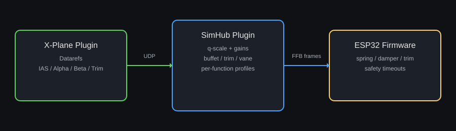

# X-Plane FFB (Graph-Based)

This document describes the graph-driven force-feedback (FFB) pipeline used for X-Plane in the DIY FFB pedal/stick system.

Quick navigation:
- Architecture and data flow
- Inputs and outputs
- Graph workflow and tuning
- Profiles and persistence
- Troubleshooting
- Migration notes

## Architecture and Data Flow

1) X-Plane native plugin (DiyFfb Data Provider):
   - Streams the required telemetry over UDP.

2) SimHub plugin:
   - Builds graph inputs from the latest UDP packet.
   - Evaluates the active FFB graph.
   - Sends compact FFB frames to the ESP32 (spring, damper, friction, trim, buffet, load).

3) ESP32 firmware:
   - Applies the FFB outputs per function.
   - Reverts to safe defaults if updates stop arriving.

Note: The diagram illustrates the data flow. The legacy hardcoded math has been replaced by the graph runtime.

## Inputs (UDP -> Graph)

The graph input set is defined in `FFB_Graph_Signal_Catalog.md`. Common X-Plane inputs include:
- IAS (kts)
- Alpha/Beta (deg)
- Trim (normalized)
- Body rates (roll/pitch/yaw)
- Aero torque (roll/pitch/yaw)
- Main rotor torque and speed (for helicopters)
- On-ground flag

All inputs are normalized in the graph and used directly by nodes.

## Outputs (Graph -> ESP32)

Graph outputs are mapped directly to flight FFB frames:
- `FlightStickPitch.*`
- `FlightStickRoll.*`
- `FlightPedals.*`
- `FlightStickCollective.*`

Each group supplies:
- SpringGain
- DamperGain
- Friction
- LoadForce
- TrimOffset
- BuffetAmplitude (not used by collective)

The SimHub plugin sends these values each update tick while telemetry is fresh.

## Graph Workflow and Tuning

1) Choose a graph:
   - Use the **FFB Graph** tab to select a vehicle-specific graph or a game-level fallback.
   - Default templates live in `graphs/templates/` (e.g., plane and helicopter defaults).

2) Tune parameters:
   - The **Vehicle/Aircraft** tab lists all non-System graph parameters grouped by the Param node Group (function groups included).
   - System-level parameters appear under **System Parameters** on the FFB Graph tab (Group = `System`).
   - Per-function parameters appear under **FFB Parameters** in the function tabs (Group starts with the function name, e.g., `FlightStickPitch`).

3) Validate outputs:
   - Each function tab shows the live graph outputs in the **FFB Outputs** panel.

## Profiles and Persistence

- Per-aircraft profiles store graph parameter values.
- You can save or load profiles from the FFB Graph tab.
- Graph parameter changes are tracked and prompted on aircraft changes.

## Troubleshooting

Symptom: No FFB movement at all
- Ensure the ESP32/gateway connection is active.
- Confirm the active graph status is valid in the FFB Graph tab.
- Check that the X-Plane UDP data provider is running.
- Verify the UDP toggle and port in the X-Plane system tab (or `XPlaneUdpEnabled`/`XPlaneUdpPort` in the settings JSON).

Symptom: Outputs remain at zero
- Confirm telemetry is fresh (X-Plane running and UDP streaming).
- Ensure the graph outputs are connected to the output nodes.

## Migration Notes (Legacy Removal)

- The legacy X-Plane FFB math and tuning sliders were removed on 2026-01-29.
- Legacy tuning fields in saved configs are now ignored; adjust tuning in the graph instead.
- Rotor selection is now auto by default; advanced users can still set `XPlaneRotorIndex` in settings if needed.
