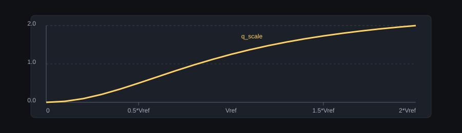
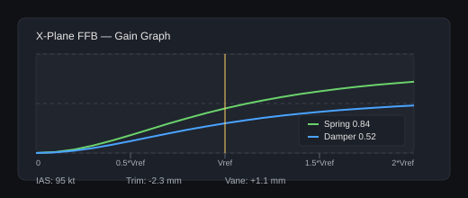

# X-Plane FFB Design and Tuning Guide

This document explains the X-Plane force-feedback (FFB) pipeline used by the DIY FFB pedal/stick system, the design rationale behind each choice, and provides starting values for different aircraft classes.

Quick navigation:
- Architecture and data flow
- Signal definitions and units
- Force model and scaling
- Safety and stability
- Tuning guide and aircraft presets
- Troubleshooting and validation

## Scope and Goals

Goals:
- Reliable, low-latency FFB updates for pitch/roll/yaw without heavy CAN traffic.
- Clear separation of concerns: X-Plane datarefs -> SimHub math -> ESP32 actuation.
- Per-function tuning that remains intuitive across aircraft, with per-aircraft profiles.
- A scaling scheme that preserves fine control at low speeds while keeping headroom at high speeds.

Non-goals:
- Exact hinge-moment simulation (not available from X-Plane datarefs).
- Full aeroelastic or hydraulic modeling inside the ESP32 firmware.

## High-Level Architecture

1) X-Plane native plugin (DiyFfb Data Provider):
   - Forwards selected datarefs over UDP.
   - Keeps the payload stable and minimal.

2) SimHub plugin:
   - Receives UDP data.
   - Computes per-function FFB values (pitch, roll, pedals).
   - Sends compact FFB frames to the ESP32.

3) ESP32 firmware:
   - Applies the FFB to each function.
   - Applies safety guards and reverts to defaults if no FFB updates arrive within 200 ms.

## Data Inputs (UDP -> SimHub)

Core datarefs used:
- IAS (kts): for dynamic pressure scaling.
- Alpha (deg): for pitch buffet and pitch weathervaning.
- Beta (deg): for yaw weathervaning.
- Trim (normalized): elevator, aileron, rudder.

Other datarefs can be added later, but the current pipeline is intentionally minimal.

Units and expectations:
- IAS is in knots.
- Alpha/Beta are in degrees.
- Trim values are normalized to [-1, 1].
- Trim and weathervane are converted into millimeters of trim offset in SimHub.

## Force Model (Per Function)

The SimHub plugin builds per-function outputs:

1) Spring gain:
   spring_gain = k_q * q_scale

2) Damper gain:
   damper_gain = k_rate * q_scale

3) Trim offset (mm):
   trim_mm = trim_dataref * trim_mm_per_unit

4) Buffet (optional):
   buffet_gain = buffet_scale(alpha) * buffet_gain * q_scale

5) Weathervaning (optional):
   vane_mm = weathervane_gain * q_scale * angle_deg
   - Pitch uses alpha (deg).
   - Yaw uses beta (deg).
   - Roll currently does not apply weathervaning.

Trim and weathervane are combined as a trim offset and sent to the ESP32.

### Dynamic Pressure Scaling (q_scale)

We use a saturating function based on IAS to keep tuning intuitive:

q_scale = min(MaxQScale, (2 * q_hat) / (q_hat + vref^2))
q_hat = IAS_mps^2

Key properties:
- q_scale = 1.0 at IAS = Vref.
- q_scale rises smoothly with IAS.
- q_scale saturates at MaxQScale (currently 2.0) to keep gains bounded.

Rationale:
- Linear IAS scaling makes low-speed tuning too coarse and high-speed tuning too aggressive.
- Squared IAS (q_hat) preserves aerodynamic intuition and better tracks the feel of dynamic pressure.
- Saturation provides headroom without letting gains run away.

Notes:
- MaxQScale is currently 2.0, so gains at very high IAS will asymptotically approach 2x the value at Vref.
- Because q_scale is bounded, plots will naturally flatten at high IAS.

## Design Rationales

Why compute in SimHub instead of ESP32:
- Easier tuning and per-aircraft configuration.
- SimHub has direct access to game data and profiles.

Why per-function settings:
- Pitch, roll, and yaw require distinct gains, trim scales, and weathervaning strength.
- Aircraft-specific geometry and control gearing vary significantly.

Why "gains at Vref":
- Vref provides a concrete speed reference.
- You can tune the feel at a meaningful speed and let scaling handle the rest.

Why UDP for X-Plane data:
- Stable, low-latency data stream without relying on SimHub-provided raw data for X-Plane 12.

Why add weathervane as trim offset:
- It acts as a slow neutral shift rather than a high-frequency force.
- It composes naturally with trim in the firmware, keeping the actuator model simple.

Why keep buffet optional:
- Buffet cues are aircraft-specific and can be intrusive at higher gains.
- It is easier to enable and tune per aircraft than to auto-guess.

## Output Signals (SimHub -> ESP32)

Each function emits a single FFB frame containing:
- Spring gain (float, scaled and packed).
- Damper gain (float, scaled and packed).
- Trim offset (mm, signed).
- Buffet gain (float, scaled and packed).

The ESP32 applies these as the current target for the active function, and will fall back to defaults if updates stop.

## Safety and Stability Guards

- ESP32 restores default damping and spring after 200 ms without FFB updates.
- Damper is clamped to a stability limit on the firmware side.
- Per-function enable toggle allows quick disable in case of unstable behavior.

Guidance:
- If you observe oscillation or snapping at high damper values, reduce k_rate first.
- If oscillation occurs only at high IAS, lower MaxQScale or reduce k_rate.

## UI Elements

X-Plane FFB panel (per function):
- Enable toggle.
- Spring gain @ Vref.
- Damper gain @ Vref.
- Trim scale (mm per unit).
- Buffet start/full and gain @ Vref.
- Weathervane gain @ Vref.
- Vref (kts).
- Gain graph with IAS cursor and numeric readouts.
- Trim/Weathervane readout (mm).

## Tuning Guide

General tuning flow:
1) Set Vref to a typical approach or cruise speed for the aircraft.
2) Start with low k_q and k_rate to avoid instability.
3) Increase k_q until static centering feels correct at Vref.
4) Increase k_rate until oscillation is damped without sluggishness.
5) Set trim scale so a full trim change produces a noticeable but not excessive travel change.
6) Add weathervane gain for yaw (and optionally pitch) if desired.
7) Add buffet only if the aircraft should exhibit stall cues.

## Gain Panel Mock

## Tuning Checklist

1) Enable X-Plane UDP input and verify data is arriving.
2) Set Vref to a meaningful speed (approach or typical cruise).
3) Set k_q low and confirm basic centering at Vref.
4) Increase k_rate until oscillation is damped without sluggishness.
5) Adjust trim scale until a full trim change produces a noticeable neutral shift.
6) Add weathervane (yaw first, then pitch if desired).
7) Add buffet only if stall cues are needed; confirm angles and gain.
8) Save the aircraft profile.

If you can only tune a single parameter:
- Start with k_q, then k_rate.
- Leave trim and buffet at 0 until the base feel is stable.

### Suggested Starting Values

All values are "gain @ Vref". Trim scale is in mm per unit. Buffet angles are in degrees.

Single-engine GA (C172, PA-28):
- Vref: 55-65 kts
- Pitch: k_q 0.50, k_rate 0.20, trim 8.0
- Roll:  k_q 0.35, k_rate 0.15, trim 6.0
- Yaw:   k_q 0.25, k_rate 0.10, trim 5.0, weathervane 0.10
- Buffet: start 12, full 18, gain 0.10

High-performance GA / aerobatic (Extra, RV):
- Vref: 80-100 kts
- Pitch: k_q 0.70, k_rate 0.25, trim 6.0
- Roll:  k_q 0.60, k_rate 0.20, trim 5.0
- Yaw:   k_q 0.35, k_rate 0.15, trim 4.0, weathervane 0.08
- Buffet: start 14, full 20, gain 0.08

Glider / sailplane:
- Vref: 45-55 kts
- Pitch: k_q 0.45, k_rate 0.18, trim 10.0
- Roll:  k_q 0.30, k_rate 0.12, trim 8.0
- Yaw:   k_q 0.20, k_rate 0.08, trim 6.0, weathervane 0.12
- Buffet: start 10, full 16, gain 0.06

Turbo-prop / light twin (King Air, Seneca):
- Vref: 90-110 kts
- Pitch: k_q 0.60, k_rate 0.22, trim 6.0
- Roll:  k_q 0.45, k_rate 0.18, trim 5.0
- Yaw:   k_q 0.35, k_rate 0.15, trim 4.0, weathervane 0.10
- Buffet: start 14, full 22, gain 0.08

Jet airliner (A320, 737):
- Vref: 130-150 kts
- Pitch: k_q 0.35, k_rate 0.20, trim 4.0
- Roll:  k_q 0.30, k_rate 0.18, trim 3.5
- Yaw:   k_q 0.25, k_rate 0.15, trim 3.0, weathervane 0.06
- Buffet: start 16, full 24, gain 0.06

Warbird / high-speed prop (P-51, Spitfire):
- Vref: 100-120 kts
- Pitch: k_q 0.70, k_rate 0.28, trim 6.0
- Roll:  k_q 0.60, k_rate 0.24, trim 5.0
- Yaw:   k_q 0.45, k_rate 0.20, trim 4.0, weathervane 0.12
- Buffet: start 12, full 20, gain 0.12

Rotorcraft (light helicopter):
Note: Helicopter control feel is dominated by rotor dynamics and trim systems.
Start low and adjust carefully.
- Vref: 60-80 kts
- Pitch: k_q 0.25, k_rate 0.12, trim 4.0
- Roll:  k_q 0.25, k_rate 0.12, trim 4.0
- Yaw:   k_q 0.20, k_rate 0.10, trim 3.0, weathervane 0.15
- Buffet: start 0 (disabled), full 0, gain 0

### Tuning by Feel

If the controls feel:
- Too stiff at all speeds: reduce k_q (and k_rate if needed).
- Too soft at low speed but OK at cruise: increase Vref, then re-tune k_q.
- Too stiff at high speed only: decrease MaxQScale or reduce k_q.
- Oscillatory around center: increase k_rate slightly, or reduce k_q.
- Sluggish and heavy: reduce k_rate and check simulated mass on the ESP32 side.

### Trim and Weathervane Tips

- Trim scale is in mm per unit. A value of 5 means full trim shifts neutral by 5 mm.
- Weathervane gains are small; start at 0.05-0.15 at Vref for yaw.
- For pitch weathervane, start lower (0.03-0.08) and adjust carefully.

### Buffet Tips

- Keep buffet gain low (0.05-0.12 at Vref) and adjust with alpha thresholds.
- Start/full angles are aircraft-specific; more aggressive stall models may need higher start angles.
- Buffet is multiplied by q_scale, so it intensifies with IAS.

### Notes on Trim and Weathervane

- Trim inputs are normalized to [-1, 1] from X-Plane.
- Trim scale is in mm per unit; start low and increase until trim changes are noticeable.
- Weathervane is an additional trim offset, so it will shift the neutral position.

## Profiles and Persistence

Per-aircraft profiles:
- SimHub stores FFB settings keyed by aircraft CarId.
- You can save/load the current aircraft profile or the entire map as JSON.

Suggested workflow:
1) Tune an aircraft.
2) Save its profile.
3) Use a similar profile as a baseline for a new aircraft class.

## Troubleshooting

Symptom: No FFB movement at all
- Check X-Plane UDP enabled in system settings.
- Verify X-Plane native plugin is sending data.
- Ensure per-function FFB enabled toggle is on.

Symptom: FFB works, but trim has no effect
- Confirm trim datarefs are changing in X-Plane.
- Increase trim scale.
- Check that trim range is not clamped by travel limits.

Symptom: Gain graph cursor frozen
- Ensure UDP updates are arriving.
- Verify SimHub plugin shows a recent aircraft.

Symptom: Strong oscillation or snapping
- Reduce k_rate and k_q.
- Check simulated mass and damping on the ESP32 side.
- Ensure update rate is steady (avoid long gaps).

## Validation Checklist

Before flight:
- Set Vref and verify gain graph scales as expected.
- Move controls at idle, taxi, and takeoff speeds to confirm scaling.
- Apply trim and confirm neutral shift.
- Check weathervane effect during crosswind or slip.

In flight:
- Observe damping and centering changes with speed.
- Tune buffet near stall if needed.

## Future Extensions

- Centralize more FFB math in XPlaneFfbMath (buffet curve, trim mapping).
- Add optional softening near travel limits based on axis position.
- Add dedicated turbulence/buffet datarefs if available.
